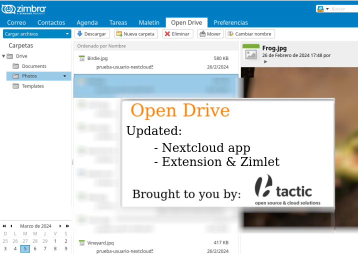

# Updated Open Drive releases

Neither Zimbra nor Zextras are releasing compatible versions for ZimbraDrive v1 / Open Drive Nextcloud apps since a long time.

Here you will be able to download recent versions of:

- The Nextcloud app for recent Nextcloud versions.
- The Extension and zimlet for recent Zimbra versions.



## Recent Downloads

- [Open Drive v0.8.29](https://github.com/btactic/zimbra-drive/releases/tag/v0.8.29)
    - Compatible with:
        - Nextcloud 28
        - Nextcloud 29
    - Compatible with:
        - ZCS 10.1.x

- [Open Drive (Nextcloud app only) v0.8.26](https://github.com/btactic/zimbra-drive/releases/tag/app-v0.8.26)
    - Compatible with:
        - Nextcloud 24
        - Nextcloud 25
        - Nextcloud 26
    - Compatible with:
        - ZCS 8.8.15
        - ZCS 9.0.0

- [Open Drive (Nextcloud app only) v0.8.27](https://github.com/btactic/zimbra-drive/releases/tag/app-v0.8.27)
    - Compatible with:
        - Nextcloud 26
        - Nextcloud 27
    - Compatible with:
        - ZCS 8.8.15
        - ZCS 9.0.0

Please check [releases](https://github.com/btactic/zimbra-drive/releases) for the most recent versions.

## How to update (Nextcloud app)

If you want to update your existing ZimbraDrive app in your Nextcloud installation you need to:

- Move current `/var/www/html/apps/zimbradrive` folder out of the way
- Extract the new version:
```
tar -xzvf zimbradrive-0.8.29.tar.gz  --directory=/var/www/html/apps
```

Make sure to change `/var/www/html` so that it matches your Nextcloud root folder.

## How to update (Extension and zimlet)

Just check:

- [2. Install the Zimbra Extension](#2-install-the-zimbra-extension)
- [4. Install the ZimbraDrive zimlet](#4-install-the-zimbradrive-zimlet)

from the original instructions below.

## About

Updated ZimbraDrive app for Nextcloud, extension for Zimbra and zimlet for Zimbra are being developed by BTACTIC, S.C.C.L. ( [http://www.btactic.com](http://www.btactic.com) )

---

---

---

Open Drive
============

Open Drive is not not a fully fledged Zextras product under active support and development, but a contribution provided to the Zimbra Community "as is". 

Anyone is free to download it and to clone the repository to apply any change complying with the project's licensing but there is no official commitment on updates, on the inclusion of features and/or the approval of pull requests. 

---
 

Zimbra and Nextcloud integration.

Features:
- Use Zimbra credentials in Nextcloud.
- Navigate Nextcloud files inside Zimbra.
- Manage Nextcloud files inside Zimbra (upload, move, rename, delete).
- Attach Nextcloud files to email.

Supported Versions:
- Nextcloud: 24, 25, 26, 27, 28

## Install

### 0. Check package integrity
Verify the files using the provided `md5` file:
```bash
md5sum -c zimbra_drive.md5
```

### 1. Extract Zimbra files
Extract `zimbra_drive.tgz`
```bash
mkdir -p /tmp/zimbradrive
tar -xvf zimbra_drive.tgz --directory /tmp/zimbradrive
```

### 2. Install the Zimbra Extension
- Create directory `/opt/zimbra/lib/ext/zimbradrive`
```bash
mkdir -p /opt/zimbra/lib/ext/zimbradrive
```
- Copy `/tmp/zimbradrive/zimbra-extension/zal.jar` and `/tmp/zimbradrive/zimbra-extension/zimbradrive-extension.jar` in `/opt/zimbra/lib/ext/zimbradrive`
```bash
cp /tmp/zimbradrive/zimbra-extension/zal.jar /tmp/zimbradrive/zimbra-extension/zimbradrive-extension.jar /opt/zimbra/lib/ext/zimbradrive
```
- Restart the mailbox to let the extension to be loaded correctly.
```bash
zmmailboxdctl restart
```

### 3. Configure the Zimbra Extension
- Set the Nextcloud/owncloud service url foreach domain. The cloud service url (CLOUD_URL) has to be in the form: protocol://cloudHost/path_to_index.php.
```bash
zmprov md domainExample.com zimbraDriveOwnCloudURL https://cloud.example.com/index.php
```

### 4. Install the ZimbraDrive zimlet
Change owner and group of `/tmp/zimbradrive/zimlet/com_btactic_drive_open.zip`
```bash
chown zimbra:zimbra /tmp/zimbradrive/zimlet/com_btactic_drive_open.zip
```
Deploy the zimlet
```bash
zmzimletctl deploy /tmp/zimbradrive/zimlet/com_btactic_drive_open.zip
```
Enable the zimlet in your class of service.

### 5. Install Nextcloud ZimbraDrive App
Get the zimbradrive application from https://apps.nextcloud.com/apps/zimbradrive.
Extract `zimbradrive.tar.gz` in the folder `apps` of Nextcloud.
```bash
tar -xzvf zimbradrive.tar.gz  --directory=/var/www/html/apps
```
Login in Own/Next Cloud as an administrator, in `App` menu, enable `ZimbraDrive`, or by command line
```bash
sudo -u www-data php /var/www/html/occ app:enable zimbradrive
```

### 6. Configure Nextcloud ZimbraDrive App
Configure the Zimbra Server into to the `Zimbra Drive` section in the **Admin Configuration** of Your Nextcloud instance.

- Enable `Allow Zimbra's users to log in` and `Enable Zimbra authentication back end`
- Set Zimbra's host and port
- Enable `Use SSL` if the Zimbra server required an SSL connection (recommended)
- Enable `Enable certificate verification` if the Zimbra server provide a valid certificate (recommended)
- To enable the auto login for the Nextcloud's users whom click on the Zimbra icon in the Nextcloud web GUI, insert the `Domain Preauth Key`

Click to `Test page` button to check if there are problems with the server connection.

**Note**
The preauth key can be generate with:
```bash
zmprov generateDomainPreAuthKey domain.com
```
If the preauth key already exists, it can be obtained with:
```bash
zmprov getDomain domain.com zimbraPreAuthKey
```
## Uninstall

### Remove all Zimbra Users from Nextcloud

If the administrator remove the Nextcloud App the Zimbra users will not be visible anymore in the
Nextcloud administration panel.

**Note** To manually disable the authentication through Zimbra remove these lines to the Nextcloud configuration:
```php
'user_backends' => array (
 0 => array (
   'class' => 'OC_User_Zimbra',
   'arguments' => array(),
 ),
),
```

**WARNING:** This process will delete all the Zimbra Users data from Nextcloud and is not reversible.

To remove all the Zimbra Users from the Nextcloud installation run this command:
```bash
cd /var/www/nextcloud # Go to the OCC path
mysql_pwd='password'  # Set the database password
occ_db='nextcloud'    # Set the database name for the Nextcloud

mysql -u root --password="${mysql_pwd}" "${occ_db}" -N -s \
    -e 'SELECT `uid` FROM `oc_zimbradrive_users`' \
    | while read uid; do \
        sudo -u www-data php ./occ user:delete "${uid}"; \
        mysql -u root --password="${mysql_pwd}" "${occ_db}" \
            -e "DELETE FROM oc_accounts WHERE uid = '${uid}' LIMIT 1"; \
      done
```

## Issues
Zimbra Drive is an official Zimbra product - support is provided through the official Zimbra channels to both Open Source and Network Edition customers.
